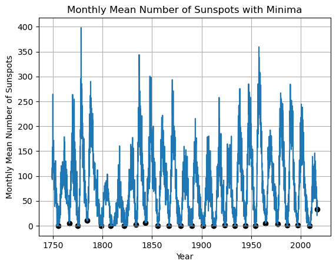
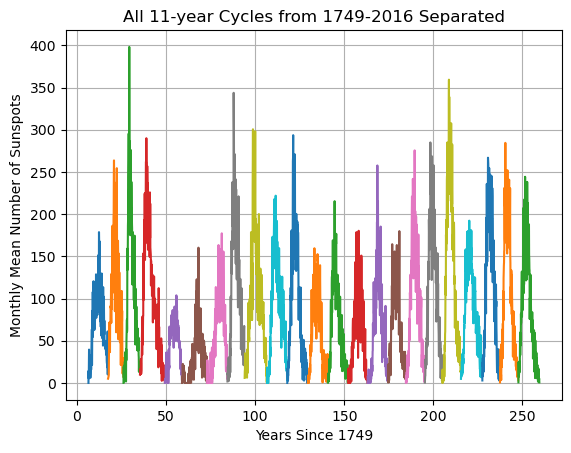
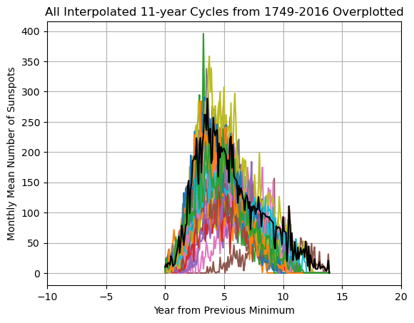
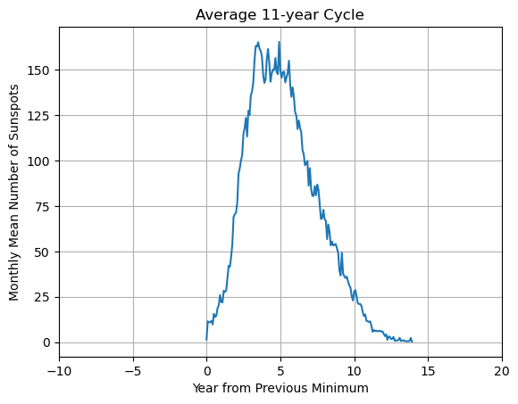
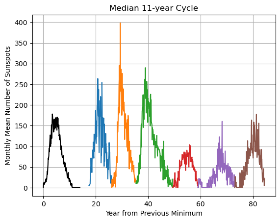
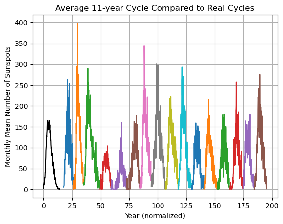

# average-solar-cycle
Algorithm to create the size and shape of the mean and median solar cycle in the historical sunspot count dataset.

First, the edges of each of the solar cycles throughout the entire historical sunspot record are identified.

With the edges, the solar cycles can be separated from each other.

To more easily compare them, they can be overplotted.

From all of the cycles, the size and shape of the mean solar cycle can be calculated.

The size and shape of the median solar cycle can be calculated as well.

This mean solar cycle can be compared to some of the real solar cycles to see whether or not they are similar.

